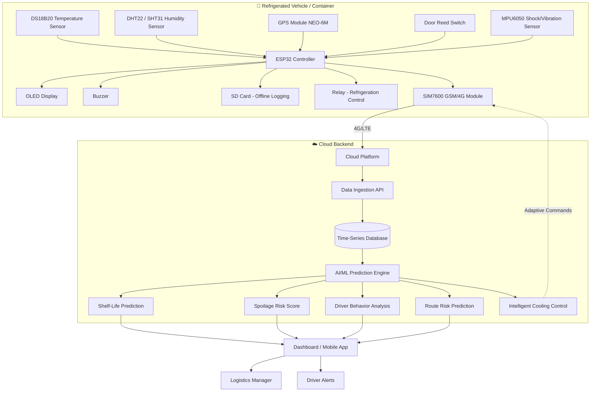
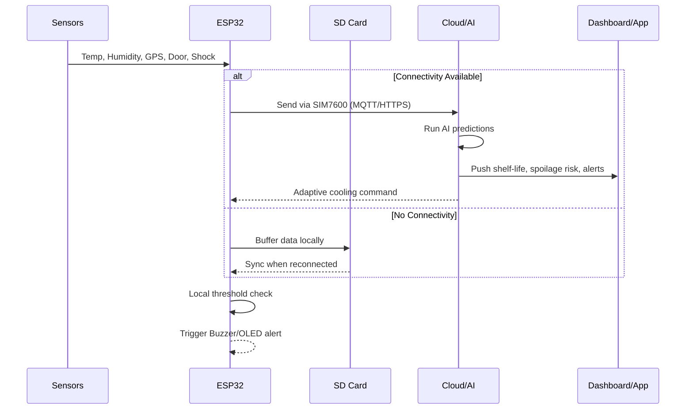

# 🧊 Smart Cold Chain Monitoring System

**IoT-based real-time monitoring and AI-driven spoilage prediction for food & pharmaceutical logistics**


---

## 📑 Table of Contents

- [Problem Statement](#-problem-statement)
- [Proposed Solution](#-proposed-solution)
- [System Architecture](#-system-architecture)
- [Hardware Components](#-hardware-components)
- [Software & Cloud Stack](#-software--cloud-stack)
- [Working Methodology](#-working-methodology)
- [Unique Features](#-unique-features)
- [Reliability, Security & Maintenance](#-reliability-security--maintenance)
- [Bill of Materials & Cost Estimation](#-bill-of-materials--cost-estimation)
- [Feasibility](#-feasibility)
- [Future Scope](#-future-scope)
- [Repository Structure](#-repository-structure)

---

## 🎯 Problem Statement

### Problem
Perishable goods such as food, vaccines, and medicines are highly sensitive to environmental conditions during transport and storage. Even brief excursions outside the safe temperature/humidity range can render vaccines ineffective or spoil food, often without any visible sign until it is too late. Traditional cold chain monitoring relies on manual temperature logging or basic threshold alarms, which are reactive rather than predictive and frequently fail to capture the full picture (door openings, physical shocks, route conditions).

### Target Users
- Pharmaceutical and vaccine distribution companies
- Cold storage & food logistics operators
- Hospitals and healthcare supply chains
- Government immunization programs
- Third-party logistics (3PL) providers for perishables

### Motivation
The World Health Organization estimates that a significant proportion of vaccines lose potency due to cold chain failures before administration. Food spoilage during transport similarly leads to major economic loss and health risks. A predictive, always-on monitoring system can prevent loss before it happens rather than merely recording it after the fact.

---

## 💡 Proposed Solution

### Overview
An ESP32-based IoT device is mounted inside a refrigerated container/vehicle. It continuously measures temperature, humidity, location, door access, and physical shocks, streaming this data to the cloud over 4G. An AI/ML layer on the cloud converts raw sensor readings into actionable predictions — remaining shelf life, spoilage risk score, and driver behavior score — instead of raw numbers alone.

### Objectives
- Provide real-time visibility into the condition of goods in transit
- Predict spoilage risk **before** it occurs, not just detect it after
- Detect unauthorized door openings and rough handling
- Enable intelligent, adaptive refrigeration control instead of simple ON/OFF cycling
- Recommend safer delivery routes based on historical spoilage data

### Expected Outcome
- Reduced spoilage/wastage of food and pharmaceuticals
- Early alerts to logistics managers and drivers
- Data-driven accountability across the supply chain
- Lower insurance and compliance risk for cold chain operators

---

## 🏗 System Architecture



---

## 🔧 Hardware Components

| Component | Purpose |
|---|---|
| ESP32 | Main controller |
| DS18B20 Temperature Sensor | Accurate temperature measurement |
| DHT22 / SHT31 | Humidity monitoring |
| GPS Module (NEO-6M) | Vehicle location tracking |
| SIM7600 GSM/4G Module | Cloud communication without Wi-Fi |
| Door Reed Switch | Detect unauthorized door opening |
| MPU6050 | Detect shocks or mishandling |
| Buzzer | Local audible alert |
| OLED Display | Live status display |
| SD Card Module | Offline data logging |
| Relay Module | Control refrigeration unit (optional) |
| 18650 Li-ion Battery + TP4056 Module | Backup power during mains/vehicle power loss |
| Voltage Divider (2 resistors) | Lets the ESP32 sense battery voltage/charge level |

### Pin Connections

```
DS18B20 -------- GPIO4
DHT22 ---------- GPIO15
GPS TX --------- GPIO16
GPS RX --------- GPIO17
Door Sensor ---- GPIO27
MPU6050 SDA ---- GPIO21
MPU6050 SCL ---- GPIO22
OLED SDA ------- GPIO21 (shared I2C bus)
OLED SCL ------- GPIO22 (shared I2C bus)
SIM800L TX ----- GPIO18
SIM800L RX ----- GPIO19
Buzzer --------- GPIO26
Relay ---------- GPIO25
Battery Sense -- GPIO34 (analog, via voltage divider)
Power-Loss Detect - GPIO32 (digital, senses mains presence)
```

---

## 💻 Software & Cloud Stack

- **Firmware:** Arduino/C++ or MicroPython on ESP32
- **Communication Protocol:** MQTT / HTTPS over 4G (SIM7600)
- **Cloud Platform:** AWS IoT Core / Azure IoT Hub / Firebase (any MQTT-compatible broker)
- **Database:** Time-series DB (InfluxDB / TimescaleDB) for sensor logs
- **AI/ML Engine:** Python (scikit-learn / TensorFlow) for shelf-life & spoilage prediction models
- **Dashboard:** React/Flutter web & mobile app for logistics managers and drivers
- **Offline Resilience:** Local SD card buffering with sync-on-reconnect

---

## ⚙️ Working Methodology

1. **Sensing:** ESP32 continuously polls temperature, humidity, GPS, door status, and shock sensors.
2. **Local Processing:** Data is displayed on the OLED and buzzer alerts trigger for immediate threshold breaches (e.g., door left open, extreme temperature).
3. **Offline Logging:** If connectivity is lost, readings are buffered on the SD card.
4. **Transmission:** Data is transmitted over 4G via SIM7600 using MQTT/HTTPS to the cloud, with buffered data synced once connectivity resumes.
5. **Cloud Processing:** The AI engine ingests the stream and computes:
   - Remaining shelf life (e.g., "16 hours")
   - Spoilage probability score (e.g., "76% risk" based on temperature deviation, humidity, and door-opening frequency)
   - Driver behavior score from MPU6050 (harsh braking, vibration, rough handling)
   - Route risk by comparing the current route against historical spoilage data
6. **Actuation:** Based on predictions, the cloud can send adaptive cooling commands back to the relay-controlled refrigeration unit.
7. **Alerting:** Dashboard and mobile app notify logistics managers and drivers in real time; critical alerts also sound the local buzzer.



---

## ✨ Unique Features

1. **Product Shelf-Life Prediction** — instead of raw temperature, shows "Remaining shelf life: 16 hours"
2. **Driver Behavior Analysis** — detects harsh braking, vibration, and rough handling using MPU6050, useful for dairy, fragile medicines, and vaccines
3. **Intelligent Cooling** — AI adjusts refrigeration based on ambient temperature, route, and delivery duration instead of simple ON/OFF control
4. **Route Risk Prediction** — compares the current route to historical spoilage data and suggests safer alternate paths
5. **Spoilage Probability Score** — combines temperature, humidity, and door-opening frequency into a single actionable risk percentage
6. **Resilience-by-Design** — unlike most prototype-stage IoT projects, this system explicitly accounts for sensor calibration drift, software/hardware failures, power loss, and cloud security (see below) instead of assuming ideal, always-on conditions

> **Market honesty note:** predictive risk scoring, shock detection, and route-based risk analysis are not novel to the industry — established players (Sensitech, Controlant, ORBCOMM, Emerson) already offer commercial platforms with similar capabilities in a market worth tens of billions of dollars. The real differentiator here is **accessibility**: an open, ~₹4,000 device versus an enterprise SaaS contract, aimed at small-scale operators (local vaccine distributors, small food transporters, rural cold chains) that commercial platforms don't prioritize.

---

## 🛡 Reliability, Security & Maintenance

Most cold chain prototypes work fine in a demo and then quietly fail in the field. This design addresses four specific real-world risks directly:

| Risk | Failure mode if unhandled | How this design handles it |
|---|---|---|
| **Maintenance & calibration drift** | Sensors slowly drift out of accuracy over months while the system keeps reporting numbers with false confidence | Firmware tracks time since last calibration and flags a "Calibration Due" state past a threshold; readings taken after that point nudge the risk score up rather than being silently trusted, and the event is logged for a technician |
| **System failures (software hangs)** | A bug or a sensor library that never returns leaves the device frozen — powered on but not actually monitoring, with no one aware | A hardware watchdog timer force-reboots the device if the main loop stops responding within 10 seconds — standard practice for unattended embedded devices |
| **Power dependency** | If vehicle/mains power fails with no backup, the entire system goes dark exactly when a stalled, unrefrigerated shipment needs monitoring most | A battery-voltage sense circuit and mains-loss detector recognize the switch to backup power, log the event, sound an alert, and drop into a reduced-power mode to extend battery runtime |
| **Security risks** | Plain HTTP cloud uploads can be intercepted or spoofed; unauthenticated devices are a classic IoT attack surface | Cloud uploads use HTTPS with a device API key header instead of unauthenticated plain HTTP |

**Honest limitations of the current implementation:** the calibration timer uses device uptime rather than real calendar time (production would sync via NTP or an onboard RTC), and the HTTPS connection currently skips certificate validation for simulator simplicity — a production deployment should validate the server certificate or use mutual TLS with per-device certificates.

---

## 💰 Bill of Materials & Cost Estimation (Cost-Optimized, INR)

The original design used a SIM7600 4G module (₹3,200 — nearly half the device cost) for bandwidth this application doesn't need (small JSON payloads, not video). Swapping to a 2G SIM800L module and adding battery-backup components (which also fixes the power-dependency risk above) results in a **cheaper device overall**:

| Component | Original Cost (₹) | Optimized Cost (₹) |
|---|---|---|
| ESP32 Dev Board | 450 | 450 |
| DS18B20 Sensor | 150 | 150 |
| DHT22 Sensor | 350 | 350 |
| NEO-6M GPS Module | 650 | 650 |
| Cellular module | 3,200 (SIM7600, 4G) | 450 (SIM800L, 2G) |
| Door Reed Switch | 30 | 30 |
| MPU6050 | 120 | 120 |
| Buzzer | 20 | 20 |
| OLED Display | 300 | 300 |
| SD Card Module + Card | 250 | 250 |
| Relay Module | 80 | 80 |
| Battery backup (18650 Li-ion + TP4056) | — | 350 |
| Voltage-divider resistors | — | 20 |
| Enclosure, wiring, misc. | 500 | 500 |
| **Estimated Total (per unit)** | **≈ ₹6,000–6,500** | **≈ ₹3,700–4,000** |

> **Trade-off to flag if asked:** SIM800L is 2G-only. 2G is being phased out in some regions, though it remains widely available and is more than sufficient for this application's small, infrequent data payloads. Where 2G coverage is already unavailable, the original SIM7600 (or a 4G/NB-IoT alternative) is the safer, higher-cost choice.
>
> Cloud costs (data ingestion, storage, ML inference) are usage-based and scale with fleet size; typically a small monthly amount per vehicle at moderate data rates.

---

## 📈 Feasibility

**Estimated Cost:** ~$80–90 per hardware unit; cloud/subscription costs scale with fleet size.

**Scalability:** Architecture is inherently horizontal — each vehicle is an independent MQTT publisher, so adding more vehicles only requires provisioning additional device IDs on the cloud broker/database.

**Reliability:** SD card buffering ensures no data loss during connectivity gaps; dual power design (vehicle + battery backup) can be added for continuous monitoring even if the vehicle is powered off.

**Deployment Considerations:** Requires mounting inside refrigerated compartments with sensor probes placed at representative locations; SIM7600 requires an active data SIM with fleet-wide coverage.

**Future Scope:**
- Blockchain-based tamper-proof cold chain audit trail
- Integration with warehouse IoT for end-to-end supply chain visibility
- Predictive maintenance for refrigeration units themselves
- Computer-vision based cargo inspection via onboard camera

---

## 📁 Repository Structure

```
smart-cold-chain-monitoring/
├── firmware/           # ESP32 Arduino/PlatformIO code
├── cloud/              # Cloud functions, MQTT broker config, ML models
├── dashboard/          # Web/mobile dashboard source
├── docs/               # Architecture diagrams, datasheets
├── hardware/           # Schematics, wiring diagrams, BOM
└── README.md
```

---

## 📜 License

This project is released under the MIT License — feel free to use, modify, and distribute with attribution.
